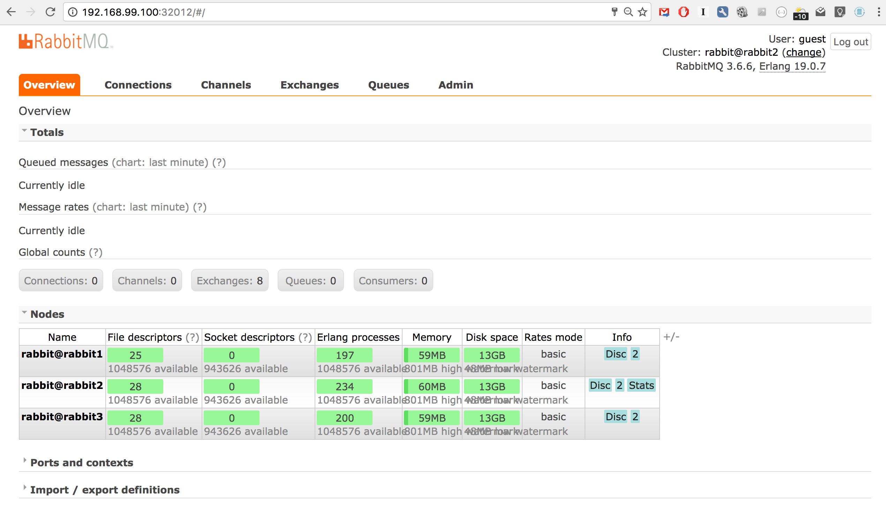

# RabbitMQ Cluster in Kubernetes
(Using the rabbitmq-clusterer plugin)

This is an example of how one might implement a rabbitmq cluster in Kubernetes using the clusterer plugin. 
Advice, input and pull requests on how to improve this would be greatly appreciated.

References:

- <https://github.com/rabbitmq/rabbitmq-clusterer>
- <https://www.rabbitmq.com/clustering.html>
- <http://thesoftjaguar.com/posts/2014/06/18/rabbitmq-cluster/>
- <https://hub.docker.com/_/rabbitmq/>
- <https://docs.docker.com/registry/>
- <https://stedolan.github.io/jq/>

## Prerequisites

This readme assumes you are familiar with running Docker plus Kubernetes/Minikube. You also need to run
a Docker Registry. 

## Build the docker image

    docker build -t localhost:5000/com/example/rabbitmq_clusterer . 
    
## Push the image
    
    docker push localhost:5000/com/example/rabbitmq_clusterer

## Start rabbitmq services

    kubectl create -f kube/rabbitmq-clustered-service1.yaml
    kubectl create -f kube/rabbitmq-clustered-service2.yaml
    kubectl create -f kube/rabbitmq-clustered-service3.yaml

## Start replication controllers

    kubectl create -f kube/rabbitmq-clustered-rc1.yaml
    kubectl create -f kube/rabbitmq-clustered-rc2.yaml
    kubectl create -f kube/rabbitmq-clustered-rc3.yaml

## Apply the cluster configuration on one of the containers

    # login to a pod
    # your pod name will vary
    kubectl exec -it rabbit1-gwoxt bash 
    apply-cluster-config.sh
    
## Check if the cluster configuration succeeded
    
    kubectl logs -f rabbit1-gwoxt
     
If successful you'll see the following at the end of the log stream:
     
     =INFO REPORT==== 19-Dec-2016::02:36:19 ===
     rabbit on node rabbit@rabbit2 up
     
     =INFO REPORT==== 19-Dec-2016::02:36:19 ===
     rabbit on node rabbit@rabbit3 up
     
## Start the rabbitmq round-robin service
     
         kubectl create -f kube/rabbitmq-clustered-svc.yaml
     
Describe the rabbitmq service:
     
     kubectl describe service rabbitmq-svc
     Name:			rabbitmq-svc
     Namespace:		default
     Labels:			name=rabbitmq-svc
     Selector:		type=rabbitmq
     Type:			NodePort
     IP:			10.0.0.172
     Port:			amqp-tls	5671/TCP
     NodePort:		amqp-tls	30399/TCP
     Endpoints:		172.17.0.5:5671,172.17.0.6:5671,172.17.0.7:5671
     Port:			amqp	5672/TCP
     NodePort:		amqp	31200/TCP
     Endpoints:		172.17.0.5:5672,172.17.0.6:5672,172.17.0.7:5672
     Port:			mgmt	15672/TCP
     NodePort:		mgmt	30849/TCP
     Endpoints:		172.17.0.5:15672,172.17.0.6:15672,172.17.0.7:15672
     Session Affinity:	None
     No events.
   
## Load the rabbitmq management console in your browser

The exposed port for the management console in this example is: `30849`. 
See `NodePort: mgmt 30849/TCP` above

   `http://<docker-host>:30849`
   
## View cluster overview

    # Full overview
    curl -s http://guest:guest@<docker-host>:30849/api/overview|jq .
    
    # See which node you are connecting to
    curl -s http://guest:guest@<docker-host>:30849/api/overview|jq .node

## Management console example

